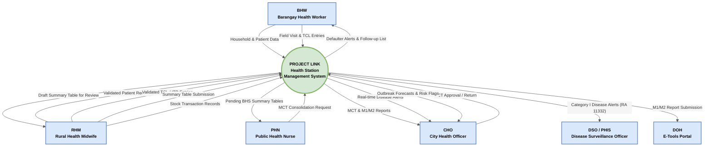

# Context Diagram (Level 0 DFD) — Project LINK

> System boundary view. Shows all external actors and the data flows
> crossing into and out of the system as a whole.
> Last updated: 2026-04-26

---

## Diagram

---

## External Entities

| Entity | Role | Data Provided to System | Data Received from System |
|---|---|---|---|
| **BHW** | Barangay Health Worker | Household profiles, patient data, field visit records | Defaulter alerts, follow-up lists |
| **RHM** | Rural Health Midwife | Validated TCL/ITR entries, Summary Table, stock transactions | Draft ST for review |
| **PHN** | Public Health Nurse | MCT consolidation request | Pending BHS Summary Tables |
| **CHO** | City Health Officer | MCT approval or return decision | MCT, M1/M2 reports, disease alerts, ML forecasts |
| **DSO / PHIS** | Disease Surveillance Officer | — (receives only) | Category I disease alerts (RA 11332) |
| **DOH** | Department of Health — E-Tools | — (receives only) | M1/M2 monthly report submissions |

---

## Notes

- The system boundary encompasses all digital processes: patient registration,
  health program documentation, disease surveillance, report generation,
  supply chain management, and predictive analytics.
- BHW operates **offline-first** via PWA (IndexedDB). Data enters the system
  boundary when synced to the central server.
- All flows crossing the boundary are accounted for in the Level 1 DFD.
  See [`level1-dfd.md`](level1-dfd.md) for the decomposed view.
