# Level 1 DFD — Project LINK

> Decomposes the system into 7 major processes, 8 data stores, and all
> data flows between actors, processes, and stores.
> Balances with the Context Diagram — every boundary flow in the Context
> Diagram is accounted for here.
> Last updated: 2026-04-26

---

## Diagram

```mermaid
---
config:
  theme: base
  themeVariables:
    primaryColor: "#f5f5f5"
    lineColor: "#555555"
    fontSize: "13px"
---
flowchart TD

    %% ── EXTERNAL ENTITIES (BHS Tier) ──────────────────────
    BHW["BHW
    Barangay Health Worker"]

    RHM["RHM
    Rural Health Midwife"]

    %% ── EXTERNAL ENTITIES (CHO Tier) ──────────────────────
    PHN["PHN
    Public Health Nurse"]

    CHO_USER["CHO
    City Health Officer"]

    DSO["DSO / PHIS
    Disease Surveillance Officer"]

    DOH["DOH
    E-Tools Portal"]

    %% ── SYSTEM PROCESSES ──────────────────────────────────
    P1(("P1
    Manage Users
    & Access"))

    P2(("P2
    Register Patients
    & Households"))

    P3(("P3
    Document Health
    Program Services"))

    P4(("P4
    Conduct Disease
    Surveillance"))

    P5(("P5
    Generate
    Program Reports"))

    P6(("P6
    Analytics &
    Forecasting"))

    P7(("P7
    Manage Supply
    & Inventory"))

    %% ── DATA STORES ───────────────────────────────────────
    D1[("D1: User Registry")]
    D2[("D2: Facility Registry")]
    D3[("D3: Patient Registry")]
    D4[("D4: Health Records")]
    D5[("D5: Disease Surveillance")]
    D6[("D6: Program Reports")]
    D7[("D7: ML & Analytics")]
    D8[("D8: Supply Inventory")]

    %% ── FLOWS: BHW ─────────────────────────────────────────
    BHW -->|"Household & Patient Data"| P2
    BHW -->|"Field Visit & TCL Entries"| P3
    P3  -->|"Defaulter Alerts & Follow-up List"| BHW

    %% ── FLOWS: RHM ─────────────────────────────────────────
    RHM -->|"Login Request"| P1
    RHM -->|"Validated Patient Records"| P2
    RHM -->|"Validated TCL Entries / ITR"| P3
    RHM -->|"Submits Summary Table"| P5
    RHM -->|"Stock Transaction Records"| P7
    P5  -->|"Draft ST for Review"| RHM

    %% ── FLOWS: PHN ─────────────────────────────────────────
    PHN -->|"Login Request"| P1
    PHN -->|"Consolidation Request"| P5
    P5  -->|"Pending BHS Summary Tables"| PHN

    %% ── FLOWS: CHO ─────────────────────────────────────────
    CHO_USER -->|"Login Request"| P1
    CHO_USER -->|"MCT Approval / Return"| P5
    P5       -->|"MCT & M1/M2 Reports"| CHO_USER
    P4       -->|"Real-time Disease Alerts"| CHO_USER
    P6       -->|"Outbreak Forecasts & Risk Flags"| CHO_USER

    %% ── FLOWS: DSO ─────────────────────────────────────────
    P4 -->|"Category I Alerts — RA 11332"| DSO

    %% ── FLOWS: DOH ─────────────────────────────────────────
    P5 -->|"M1/M2 Report Submission"| DOH

    %% ── PROCESS ↔ DATA STORE FLOWS ────────────────────────
    P1 <-->|"User Credentials & Roles"| D1
    P1  -->|"Read Facility Data"| D2

    P2 <-->|"Patient & Household Records"| D3
    P2  -->|"Read Facility Assignment"| D2

    P3 <-->|"Health Service Records"| D4
    P3  -->|"Read Patient Data"| D3

    P4 <-->|"Disease Cases & Alerts"| D5
    P4  -->|"Read Patient Data"| D3

    P5 <-->|"ST & MCT Report Data"| D6
    P5  -->|"Read Validated Records"| D4

    P6 <-->|"ML Features & Forecasts"| D7
    P6  -->|"Read Disease Data"| D5
    P6  -->|"Read Consolidated MCT"| D6

    P7 <-->|"Stock Transactions"| D8
    P7  -->|"Read Facility Data"| D2

    %% ── STYLING ────────────────────────────────────────────
    classDef external fill:#dae8fc,stroke:#6c8ebf,stroke-width:2px,color:#000,font-weight:bold
    classDef process  fill:#d5e8d4,stroke:#82b366,stroke-width:2px,color:#000
    classDef store    fill:#fff2cc,stroke:#d6b656,stroke-width:2px,color:#000

    class BHW,RHM,PHN,CHO_USER,DSO,DOH external
    class P1,P2,P3,P4,P5,P6,P7 process
    class D1,D2,D3,D4,D5,D6,D7,D8 store
```

---

## Process Descriptions

| Process | Description | Primary Actor(s) |
|---|---|---|
| **P1: Manage Users & Access** | Handles login, role-based access control, user creation, password management, and facility assignment. | RHM, PHN, CHO |
| **P2: Register Patients & Households** | BHW-initiated household profiling and patient registration. RHM validates before records become official. | BHW, RHM |
| **P3: Document Health Program Services** | Records all TCL program entries: Maternal Care, Child Health & Immunization, Family Planning, NCD/PhilPEN, TB-DOTS. Operates offline-first via BHW PWA. | BHW, RHM |
| **P4: Conduct Disease Surveillance** | Records disease cases with ICD-10 classification. Category I cases auto-trigger real-time alerts per RA 11332 within 24 hours. | RHM, DSO |
| **P5: Generate Program Reports** | The Zero-Tally engine — auto-generates Summary Tables (ST) from validated TCL records, consolidates 32 STs into MCT, and produces M1/M2 reports for DOH submission. | RHM, PHN, CHO |
| **P6: Analytics & Forecasting** | GIS heatmap of disease burden, ML outbreak forecasting (Prophet), patient risk stratification (XGBoost/SHAP). Feeds CHO decision-making. | CHO |
| **P7: Manage Supply & Inventory** | Tracks medicine and vaccine stock per BHS: received, issued, expired, returned. Triggers low-stock alerts for critical supplies. | RHM, CHO |

---

## Data Store Descriptions

| Store | Description | Corresponding ERD Entities |
|---|---|---|
| **D1: User Registry** | System user accounts, roles, and access status. | `profiles`, `health_workers` |
| **D2: Facility Registry** | CHO2 and all 32 BHS facility records with hierarchy and GIS coordinates. | `facilities` |
| **D3: Patient Registry** | Household and person records. City-wide unified patient identity across all 32 BHS. | `persons`, `households` |
| **D4: Health Records** | All clinical service records: ITR and all TCL program entries (Maternal, Child, FP, NCD, TB). | `itrecords`, `maternal_registrations`, `prenatal_visits`, `child_registrations`, `immunizations`, `ncd_registrations` |
| **D5: Disease Surveillance** | Disease case reports and real-time alerts. Source for RA 11332 compliance tracking. | `disease_cases`, `disease_alerts` |
| **D6: Program Reports** | BHS-level Summary Tables (ST) and city-level Monthly Consolidation Tables (MCT). Locked after approval. | `summary_tables`, `monthly_consolidations` |
| **D7: ML & Analytics** | ML model registry, patient risk scores, barangay-level outbreak forecasts, and feature snapshots for retraining. | `ml.risk_scores`, `ml.outbreak_forecasts`, `ml.model_registry`, `ml.feature_snapshots` |
| **D8: Supply Inventory** | Medicine and vaccine ledger per facility. Running balance maintained per transaction. | `medicines`, `inventory_ledger` |

---

## Balancing Verification (Context → Level 1)

Every data flow crossing the system boundary in the Context Diagram is
accounted for at this level:

| Context Diagram Flow | Handled By |
|---|---|
| BHW → Household & Patient Data | BHW → P2 |
| BHW → Field Visit & TCL Entries | BHW → P3 |
| System → Defaulter Alerts | P3 → BHW |
| RHM → Validated Records / ST Submission | RHM → P2, P3, P5 |
| System → Draft ST for Review | P5 → RHM |
| PHN → Consolidation Request | PHN → P5 |
| System → Pending Summary Tables | P5 → PHN |
| CHO → MCT Approval | CHO → P5 |
| System → MCT & M1/M2 Reports | P5 → CHO |
| System → Disease Alerts | P4 → CHO |
| System → Forecasts & Risk Flags | P6 → CHO |
| System → Category I Alerts | P4 → DSO |
| System → M1/M2 Submission | P5 → DOH |

---

## Notes

- **Offline-first:** P3 (Document Health Program Services) accepts data from
  BHW even without connectivity. Submissions enter `sync.queue` and are
  promoted to D4 after RHM validation.
- **Zero-Tally pipeline:** P5 is the core architectural innovation. It
  automates the TCL → ST → MCT → M1/M2 progression that previously required
  5 days of manual tallying by a single encoder.
- **Level 2 candidate:** P5 (Generate Program Reports) is complex enough to
  warrant a Level 2 DFD. See [`level2-p5-zero-tally.md`](level2-p5-zero-tally.md)
  if a more detailed decomposition is required.
