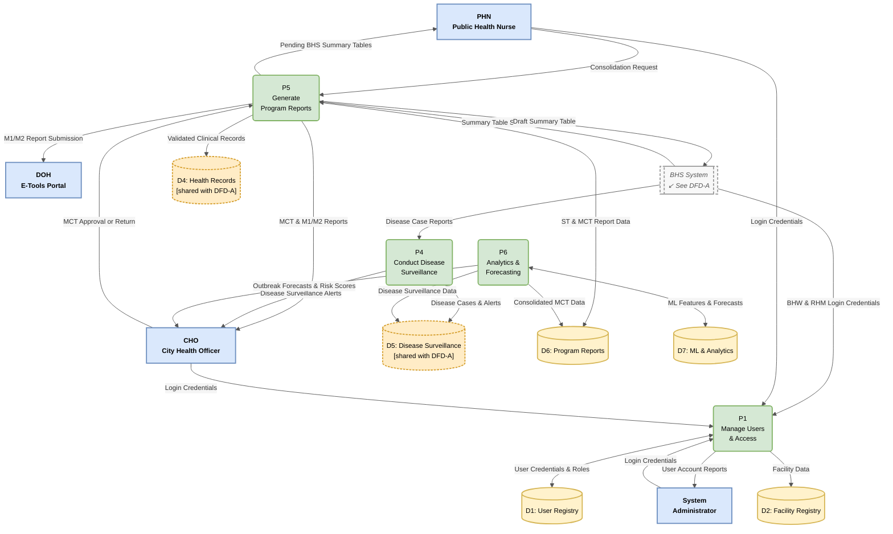

# Level 1 DFD — Two-Perspective View (Project LINK)

> Two complementary Level 1 diagrams decomposing the system by operational tier:
> **DFD-A** covers BHS field operations (BHW + RHM).
> **DFD-B** covers CHO management operations (PHN + CHO + SysAdmin).
>
> Both diagrams balance against the unified Level 1 DFD. Shared processes
> (P4) and shared data stores (D4, D5) appear in both perspectives.
> Cross-boundary reference nodes (double-bordered rectangles) indicate
> flows that cross the BHS ↔ CHO tier boundary.
>
> Notation: Gane-Sarson
> Numbering: P3a / P3b are sub-processes of P3 (Document Health Program Services).
> In formal Level 2 notation these would appear as P3.1 and P3.2.
> Last updated: 2026-04-27

---

## DFD-A — BHS Operations Perspective

> Scope: Data collection, patient registration, field health services,
> disease case recording, and supply management at the BHS level.
> Actors: BHW (Barangay Health Worker), RHM (Rural Health Midwife).
>
> Note: Authentication for BHW and RHM is handled by P1 (Manage Users &
> Access), which resides in DFD-B. The cross-boundary reference node
> [CHO System — DFD-B] represents all flows that cross into the CHO tier.

```mermaid
---
config:
  theme: base
  themeVariables:
    primaryColor: "#f5f5f5"
    lineColor: "#555555"
    fontSize: "13px"
---
flowchart TD

    %% ── EXTERNAL ENTITIES ─────────────────────────────────
    BHW["BHW
    Barangay Health Worker"]

    RHM["RHM
    Rural Health Midwife"]

    %% ── CROSS-BOUNDARY REFERENCE (CHO Tier) ───────────────
    CHO_DFD[["CHO System
    ↗ See DFD-B"]]

    %% ── PROCESSES ─────────────────────────────────────────
    P2("P2
    Register Patients
    & Households")

    P3a("P3a
    Document ITR
    Encounters")

    P3b("P3b
    Document TCL
    Programs")

    P4("P4
    Conduct Disease
    Surveillance")

    P7("P7
    Manage Supply
    & Inventory")

    %% ── DATA STORES ───────────────────────────────────────
    D2[("D2: Facility Registry")]
    D3[("D3: Patient Registry")]
    D4[("D4: Health Records")]
    D5[("D5: Disease Surveillance")]
    D8[("D8: Supply Inventory")]

    %% ── FLOWS: BHW ─────────────────────────────────────────
    BHW -->|"Household & Patient Data"| P2
    BHW -->|"Field Visit Records"| P3a
    BHW -->|"TCL Program Entries"| P3b
    P3b -->|"Defaulter Alerts & Follow-up List"| BHW

    %% ── FLOWS: RHM ─────────────────────────────────────────
    RHM -->|"Patient Record Validation"| P2
    RHM -->|"Validated ITR & Diagnoses"| P3a
    RHM -->|"Validated TCL Entries"| P3b
    RHM -->|"Disease Case Reports"| P4
    RHM -->|"Stock Transaction Records"| P7

    %% ── CROSS-BOUNDARY FLOWS ───────────────────────────────
    RHM       -->|"Summary Table Submission"| CHO_DFD
    CHO_DFD   -->|"Draft Summary Table"| RHM
    P4        -->|"Disease Surveillance Alerts"| CHO_DFD

    %% ── PROCESS ↔ DATA STORE FLOWS ────────────────────────
    P2  <-->|"Patient & Household Records"| D3
    P2   -->|"Facility Data"| D2

    P3a <-->|"ITR Records"| D4
    P3a  -->|"Patient Data"| D3

    P3b <-->|"TCL Program Records"| D4
    P3b  -->|"Patient Data"| D3

    P4  <-->|"Disease Cases"| D5
    P4   -->|"Patient Data"| D3

    P7  <-->|"Stock Transactions"| D8
    P7   -->|"Facility Data"| D2

    %% ── STYLING ────────────────────────────────────────────
    classDef external  fill:#dae8fc,stroke:#6c8ebf,stroke-width:2px,color:#000,font-weight:bold
    classDef process   fill:#d5e8d4,stroke:#82b366,stroke-width:2px,color:#000
    classDef store     fill:#fff2cc,stroke:#d6b656,stroke-width:2px,color:#000
    classDef boundary  fill:#f8f8f8,stroke:#999999,stroke-width:2px,stroke-dasharray:5 3,color:#555,font-style:italic

    class BHW,RHM external
    class P2,P3a,P3b,P4,P7 process
    class D2,D3,D4,D5,D8 store
    class CHO_DFD boundary
```

---

## DFD-B — CHO Management Perspective

> Scope: User and access management, disease alert monitoring, program
> report generation and consolidation, analytics and ML forecasting.
> Actors: PHN (Public Health Nurse), CHO (City Health Officer),
> SysAdmin (System Administrator), DOH E-Tools Portal.
>
> Note: Clinical record inputs (D4) and disease case data (D5) originate
> from BHS operations in DFD-A. The cross-boundary reference node
> [BHS System — DFD-A] represents all flows that cross from the BHS tier.
> P4 appears here to show the CHO-facing output side (alert broadcasting);
> its input side (RHM case recording) is shown in DFD-A.

---

## Process Descriptions

### DFD-A Processes

| Process | Description | Primary Actor(s) |
|---|---|---|
| **P2: Register Patients & Households** | BHW profiles households and registers persons into the unified city-wide patient registry. RHM validates records before they become official. | BHW, RHM |
| **P3a: Document ITR Encounters** | Records individual treatment encounters: OPD visits, emergency consultations, and BHW field visits. Captures chief complaint, diagnoses (ICD-10), prescriptions, and referrals. | BHW (field visits), RHM (OPD/validation) |
| **P3b: Document TCL Programs** | Records all longitudinal health program enrollments and follow-up visits: Maternal Care (prenatal, delivery, postnatal), Child Health & Immunization, Family Planning, NCD/PhilPEN, and TB-DOTS. BHW submits offline-first; RHM validates. | BHW, RHM |
| **P4: Conduct Disease Surveillance** (BHS side) | RHM records disease cases with ICD-10 classification, age group, and outcome. Category I cases are automatically flagged for priority alert routing to the CHO tier. | RHM |
| **P7: Manage Supply & Inventory** | RHM records all stock transactions per BHS: medicines and vaccines received, issued, expired, and returned. Running balance is maintained per medicine per facility. | RHM |

### DFD-B Processes

| Process | Description | Primary Actor(s) |
|---|---|---|
| **P1: Manage Users & Access** | Handles authentication for all five system roles. SysAdmin creates accounts, assigns roles, and links users to facilities. Manages password resets and access revocation. | SysAdmin (manage), all roles (authenticate) |
| **P4: Conduct Disease Surveillance** (CHO side) | Receives validated disease case data from BHS tier, updates the disease surveillance store, and broadcasts real-time alerts to CHO for Category I cases (RA 11332 ≤ 24-hour requirement). | CHO (receives alerts) |
| **P5: Generate Program Reports** | Three-stage Zero-Tally pipeline: (1) auto-generates BHS-level Summary Tables from validated TCL records on RHM submission; (2) PHN consolidates 32 approved STs into the city-level MCT; (3) CHO approves MCT and triggers M1/M2 export to DOH E-Tools. | RHM (ST), PHN (MCT), CHO (approval), DOH (destination) |
| **P6: Analytics & Forecasting** | Feeds the CHO decision-support dashboard: GIS heatmaps of disease burden by barangay, ML outbreak forecasting (Prophet time-series), and patient risk stratification (XGBoost/SHAP). Reads consolidated disease and MCT data as inputs. | CHO |

---

## Cross-Boundary Flows Summary

Flows that cross the BHS ↔ CHO tier boundary are shown via the reference
nodes and are catalogued here for balancing verification.

| Flow | From | To | Represented In |
|---|---|---|---|
| BHW & RHM Login Credentials | BHS System | P1 | BHS_DFD → P1 in DFD-B |
| Summary Table Submission | RHM (BHS) | P5 | BHS_DFD → P5 in DFD-B |
| Draft Summary Table | P5 | RHM (BHS) | P5 → BHS_DFD in DFD-B |
| Disease Case Reports | P4 (BHS side) | P4 (CHO side) | P4 → CHO_DFD in DFD-A |
| Disease Surveillance Alerts | P4 (CHO side) | CHO | P4 → CHO_USER in DFD-B |

---

## Shared Data Stores

Data stores that appear in both DFDs are marked with a dashed border in DFD-B.

| Store | DFD-A Role | DFD-B Role |
|---|---|---|
| **D4: Health Records** | P3a/P3b write ITR & TCL records; P3a/P3b read patient data | P5 reads validated clinical records to compute ST indicator values |
| **D5: Disease Surveillance** | P4 writes disease cases | P4 reads/updates alert status; P6 reads for outbreak feature extraction |

---

## Process Count Comparison

| View | Processes | Rationale |
|---|---|---|
| Unified Level 1 | 7 (P1–P7) | Standard single-diagram overview |
| DFD-A: BHS Operations | 5 (P2, P3a, P3b, P4, P7) | P3 split into P3a/P3b to distinguish ITR from TCL workflows |
| DFD-B: CHO Management | 4 (P1, P4, P5, P6) | P4 shown for alert-side only; P7 resides in DFD-A (RHM-primary) |
| **Total distinct processes** | **8** (P1–P4, P3a, P3b, P5–P7) | P4 spans both DFDs; P3 is split only in the BHS perspective |

---

## Notes

- **P3 split rationale:** ITR (P3a) records individual encounter events
  (date, complaint, diagnosis, prescription) while TCL programs (P3b)
  track longitudinal enrollment and follow-up across multiple visits.
  They write to different entity tables in D4 and have different
  validation workflows, making the split meaningful at Level 1.

- **P4 shared across perspectives:** P4 is a single system process that
  spans both tiers — RHM provides the input (case recording) at the BHS
  level, while CHO consumes the output (real-time alerts) at the CHO
  level. Showing P4 in both DFDs is standard practice for processes with
  cross-tier actor interactions.

- **P7 placement:** Supply & Inventory management (P7) resides in DFD-A
  because RHM is the primary transacting actor. CHO's read access to
  supply data is served through P6 (Analytics) via the analytics schema
  materialized views, not through direct P7 interaction.

- **Offline-first sync:** P3b accepts BHW submissions without
  connectivity. Submissions queue in `sync.queue` and are promoted to D4
  after RHM validation. This sync boundary is implicit in the BHW → P3b
  flow and is detailed in the system architecture document.

- **Gane-Sarson rendering:** For formal manuscript submission, render both
  DFDs using proper Gane-Sarson shapes in Lucidchart or draw.io. The
  cross-boundary reference nodes (dashed double-bordered boxes) have no
  formal Gane-Sarson equivalent — use a labeled external entity box with
  a note annotation to indicate the cross-DFD reference.
