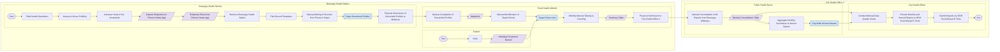

# Manual FHSIS Reporting Flowchart (Mermaid)

```mermaid
flowchart LR
  %% Swimlanes by role
  subgraph BHS["Barangay Health Station"]
    direction LR

    subgraph BHW["Barangay Health Worker"]
      direction TB
      bhw_start([Start]) --> bhw_ops[Field Health Operations]
      bhw_ops --> bhw_profile[House-to-House Profiling]
      bhw_profile --> bhw_interview[Interview Head of the Household]
      bhw_interview --> bhw_capture[/Capture Response on Phone's Notes App/]
      bhw_capture --> bhw_temp[/Temporary Record on Phone's Notes App/]
      bhw_temp --> bhw_return[Return to Barangay Health Station]
      bhw_return --> bhw_print[Print Record Templates]
      bhw_print --> bhw_write[Manual Writing of Records from Phone to Paper]
      bhw_write --> bhw_paper[[Paper Household Profiles]]
      bhw_paper --> bhw_submit[Physical Submission of Household Profiles to Midwives]
    end

    subgraph RHM["Rural Health Midwife"]
      direction TB
      rhm_compile[Manual Compilation of Household Profiles] --> rhm_master[/Masterlist/]
      rhm_master --> rhm_identify[Manual Identification of Target Clients]
      rhm_identify --> rhm_targets[[Target Client Lists]]
      rhm_targets --> rhm_tally[Monthly Manual Tallying & Counting]
      rhm_tally --> rhm_summary[/Summary Table/]
      rhm_summary --> rhm_submit[Physical Submission to City Health Office II]
    end

    subgraph PAT["Patient"]
      direction TB
      pat_start([Start]) --> pat_visits[Visits]
      pat_visits --> pat_itr[/Individual Treatment Record/]
    end
  end

  subgraph CHO2["City Health Office II"]
    direction LR

    subgraph PHN["Public Health Nurse"]
      direction TB
      phn_consolidate[Manual Consolidation of All Reports from Barangay Midwives]
      phn_consolidate --> phn_monthly[/Monthly Consolidation Table/]
      phn_monthly --> phn_aggregate[Aggregate Monthly Summaries to Annual Report]
      phn_aggregate --> phn_annual[[City-Wide Annual Reports]]
    end

    subgraph CHO["City Health Officer"]
      direction TB
      cho_qc[Conduct Manual Data Quality Check]
      cho_qc --> cho_encode[Encode Monthly and Annual Reports to DOH Excel-Based E-Tools]
      cho_encode --> cho_submit[Submit Reports via DOH Excel-Based E-Tools]
      cho_submit --> cho_end([End])
    end
  end

  %% Cross-lane handoffs
  bhw_submit --> rhm_compile
  pat_itr --> rhm_targets
  rhm_submit --> phn_consolidate
  phn_monthly --> cho_qc
  phn_annual --> cho_qc

  %% Visual grouping by artifact type (optional)
  classDef form fill:#efe7c6,stroke:#7a6a2a,color:#222;
  classDef note fill:#e6dcf2,stroke:#7a5aa6,color:#222;
  classDef doc fill:#d8e8fb,stroke:#4b83c6,color:#222;

  class rhm_master,rhm_summary,pat_itr,phn_monthly,bhw_capture,bhw_temp note;
  class rhm_targets,phn_annual,bhw_paper doc;
```
