# Recommended CHO2 Closed-Loop Operating Model Flowchart (Mermaid)

This recommended business process model shifts CHO II and its barangay health stations from a reporting-centric workflow to a closed-loop public health operating model.

Core operating principles reflected here:

- record-centric source of truth
- offline-first field capture
- exception-based validation and review
- automatic follow-up task generation
- surveillance-to-action response loops
- automated reporting derived from validated records

```mermaid
flowchart LR
  %% ============================
  %% Swimlanes
  %% ============================

  subgraph BHS["Barangay Health Station"]
    direction LR

    subgraph BHW["Barangay Health Worker"]
      direction TB
      bhw_start([Start]) --> bhw_visit[Conduct Household Visit or Service Encounter]
      bhw_visit --> bhw_capture[/Capture Record via Mobile PWA/]
      bhw_capture --> bhw_local[(Local Offline Store)]
      bhw_local --> bhw_net{Connected to Internet?}
      bhw_net -->|No| bhw_local
      bhw_net -->|Yes| bhw_sync[Background Sync]
      bhw_sync --> A1((A))

      bhw_task[Receive Follow-Up, Referral, or Correction Task]
      bhw_task --> bhw_action[Perform Follow-Up Visit, Referral Check, or Record Correction]
      bhw_action --> bhw_capture
    end

    subgraph RHM["Rural Health Midwife"]
      direction TB
      rhm_queue[Review Pending Validation and Exception Queue] --> rhm_gate{Valid, complete, and non-duplicate?}

      rhm_gate -->|No| rhm_return[/Record: Returned with Reason/]
      rhm_return --> bhw_task

      rhm_gate -->|Yes| rhm_validated[/Record: Validated/]
      rhm_validated --> A2((A))

      rhm_period[Review Due Services, Open Exceptions, and Missing Records] --> rhm_close{Ready for BHS Period Close?}
      rhm_close -->|No| rhm_followup[Send follow-up instructions or wait for pending corrections]
      rhm_followup --> bhw_task
      rhm_close -->|Yes| rhm_certify[Certify BHS Reporting Period]
      rhm_certify --> B1((B))
    end
  end

  subgraph PLATFORM["Project LINK Platform"]
    direction TB
    A1 --> sys_ingest[Receive Synced Field Records]
    sys_ingest --> sys_prescreen[Run Capture Rules, Duplicate Hints, and Service Logic]
    sys_prescreen --> sys_pending[/Pending Midwife Validation Queue/]
    sys_pending --> rhm_queue

    A2 --> sys_registry[/Validated Longitudinal Health Records/]
    sys_registry --> sys_tasks[[Follow-Up Tasks, Due Lists, and Exception Queues]]
    sys_registry --> sys_alerts[[Real-Time Disease Alerts and Hotspot Signals]]
    sys_tasks --> rhm_period

    B1 --> sys_summary[Generate Certified BHS Summary Tables]
    sys_summary --> sys_mct[/Auto-Generated Monthly Consolidation Table/]
    sys_mct --> sys_reports[/Rolling Annual Reports and Indicator Trends/]
  end

  subgraph CHO2["City Health Office II"]
    direction LR

    subgraph PHN["Public Health Nurse"]
      direction TB
      phn_ops[PHN Operations and Compliance Dashboard]
      sys_tasks --> phn_ops
      sys_alerts --> phn_ops
      sys_summary --> phn_ops

      phn_ops --> phn_triage{Issue requires PHN action?}
      phn_triage -->|BHS data issue| phn_correct[Send coaching, correction, or compliance instruction]
      phn_correct --> rhm_queue

      phn_triage -->|Field health risk| phn_investigate[Assign case investigation or outbreak response]
      phn_investigate --> bhw_task

      phn_triage -->|No critical issue| phn_release[Release monitored period for CHO review]
    end

    subgraph CHO["City Health Officer"]
      direction TB
      cho_cmd[CHO Command Dashboard]
      phn_release --> cho_cmd
      sys_mct --> cho_cmd
      sys_reports --> cho_cmd
      sys_alerts --> cho_cmd

      cho_cmd --> cho_dqc[Run Exception-Based Data Quality and Performance Review]
      cho_dqc --> cho_gate{Critical discrepancy or surge detected?}

      cho_gate -->|Yes| cho_escalate[Escalate intervention, audit, or resource reallocation]
      cho_escalate --> phn_ops

      cho_gate -->|No| cho_approve[Approve reporting cycle and intervention priorities]
      cho_approve --> cho_resource[Prioritize hotspot response, staffing, and supplies]
      cho_resource --> cho_export[Export DOH Submissions and Management Reports]
      cho_export --> cho_outputs[[Excel or PDF Reports, Hotspot Lists, and Deployment Plans]]
      cho_outputs --> cho_submit[Submit required reports and direct city action]
      cho_submit --> cho_end([End])
    end
  end

  %% ============================
  %% Optional visual classes
  %% ============================

  classDef decision fill:#efe7c6,stroke:#9a7a25,color:#222;
  classDef statusReturn fill:#f7d3d3,stroke:#c55f5f,color:#222;
  classDef statusApprove fill:#d7efcf,stroke:#67a65e,color:#222;
  classDef generated fill:#d9e6ff,stroke:#5f8dd8,color:#222;
  classDef table fill:#e7d9f7,stroke:#8b6bb8,color:#222;
  classDef input fill:#ffe3b5,stroke:#c98a1f,color:#222;
  classDef system fill:#dff1ef,stroke:#4f9b95,color:#222;

  class bhw_net,rhm_gate,rhm_close,phn_triage,cho_gate decision;
  class rhm_return statusReturn;
  class rhm_validated statusApprove;
  class sys_tasks,sys_alerts,cho_outputs generated;
  class sys_pending,sys_registry,sys_mct,sys_reports table;
  class bhw_capture input;
  class sys_ingest,sys_prescreen,sys_summary,cho_resource system;
```

